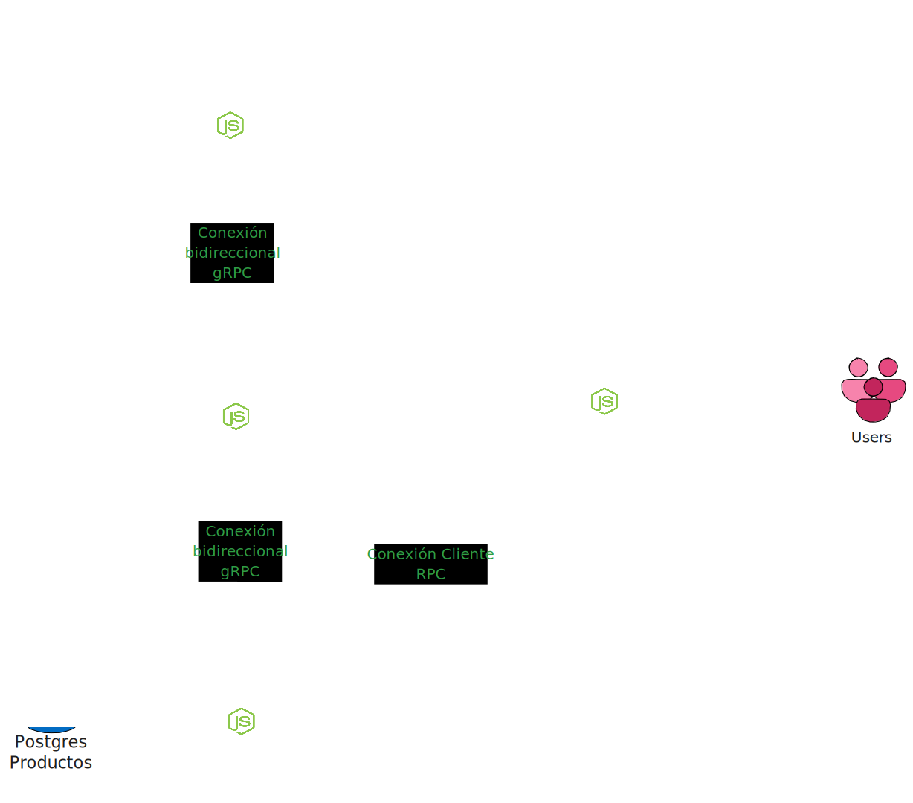

# microservicios-api-rest
---

## Descripción general

Este proyecto provee una arquitectura de microservicios combinando:

- **API REST**: Un gateway HTTP que expone endpoints para operaciones sobre clientes, pedidos y productos.
- **gRPC**: Servicios backend encargados de la lógica de negocio y persistencia.
- **Podman Compose**: Orquestación contenedorizada para levantar los servicios y bases de datos Postgresql.

El objetivo es ilustrar la comunicación entre una capa REST y múltiples microservicios gRPC, asegurando validación, consistencia de datos y manejo de errores.

---
## Diagrama de Arquitectura




En el diagrama anterior se puede apreciar una vista general de la arquitectura del proyecto, así como la conexión entre los diferentes microservicios.

---
## Base de datos Microservicios

En este proyecto se utilizan tres bases de datos diferentes para cada microservicio con el fin de mantener la independencia y escalabilidad de cada uno. A continuación se describen las bases de datos y sus respectivas tablas.

### Base de datos Clientes MariaDB
#### Tabla: `clientes`

| Columna     | Tipo            | Restricciones                                                  | Descripción                                 |
|-------------|-----------------|----------------------------------------------------------------|---------------------------------------------|
| clienteId   | CHAR(36)        | NOT NULL, DEFAULT (UUID()), PRIMARY KEY                        | Identificador único del cliente (UUID)      |
| nombre      | VARCHAR(100)    | NOT NULL                                                       | Nombre del cliente                          |
| email       | VARCHAR(255)    | NOT NULL, UNIQUE                                               | Correo electrónico del cliente              |
| telefonos   | JSON            | NOT NULL                                                       | Números de teléfono en formato JSON         |
| createdAt   | TIMESTAMP       | DEFAULT CURRENT_TIMESTAMP                                      | Fecha y hora de creación del registro       |
| updatedAt   | TIMESTAMP       | DEFAULT CURRENT_TIMESTAMP ON UPDATE CURRENT_TIMESTAMP          | Fecha y hora de última actualización        |

---
### Base de datos Pedidos MySQL

#### Tabla: `pedidos`

| Columna     | Tipo                                      | Restricciones                                        | Descripción                                 |
|-------------|-------------------------------------------|------------------------------------------------------|---------------------------------------------|
| pedidoId    | CHAR(36)                                  | NOT NULL, PRIMARY KEY, DEFAULT (UUID())              | Identificador único del pedido              |
| clienteId   | CHAR(36)                                  | NOT NULL, INDEX (idx_clienteId)                      | Identificador único del cliente             |
| estado      | ENUM('pendiente', 'cancelado', 'entregado') | NOT NULL, DEFAULT 'pendiente'                        | Estado del pedido                           |
| createdAt   | TIMESTAMP                                 | DEFAULT CURRENT_TIMESTAMP                            | Fecha y hora de creación                    |
| updatedAt   | TIMESTAMP                                 | DEFAULT CURRENT_TIMESTAMP ON UPDATE CURRENT_TIMESTAMP | Fecha y hora de última actualización        |

---

#### Tabla: `pedido_productos`

| Columna     | Tipo      | Restricciones                                  | Descripción                                 |
|-------------|-----------|------------------------------------------------|---------------------------------------------|
| pedidoId    | CHAR(36)  | NOT NULL, PRIMARY KEY (compuesto), FOREIGN KEY | Identificador del pedido                    |
| productoId  | CHAR(36)  | NOT NULL, PRIMARY KEY (compuesto), INDEX       | Identificador del producto                  |
| cantidad    | INT       | NOT NULL, DEFAULT 1                            | Cantidad de producto en el pedido           |


---
### Base de datos Productos PostgreSQL

#### Tabla: `productos`

| Columna      | Tipo            | Restricciones                          | Descripción                        |
|--------------|-----------------|----------------------------------------|------------------------------------|
| productoId   | UUID            | PRIMARY KEY, DEFAULT gen_random_uuid() | Identificador único del producto   |
| nombre       | VARCHAR(150)    | NOT NULL                               | Nombre del producto                |
| precio       | DECIMAL(10,2)   | NOT NULL                               | Precio del producto                |
| cantidad     | INT             | NOT NULL, DEFAULT 0                    | Cantidad disponible en inventario  |

---

## Requerimientos

Antes de comenzar asegúrate de tener instaladas las siguientes herramientas:

- [Node.js](https://nodejs.org/es) (v18 o superior)
- [npm](https://www.npmjs.com/)
- [Podman](https://podman.io/)
- [Podman Compose](https://docs.podman.io/en/latest/markdown/podman-compose.1.html)
- [Protoc](https://grpc.io/docs/protoc-installation/)
- [grpcurl](https://github.com/fullstorydev/grpcurl) (Opcional)

---

## Configuración y despliegue
   
1. **Clonar el repositorio**:

## Estructura del proyecto

```bash
.
├── api-rest
│   ├── podman-compose.yaml
│   └── server
│       ├── package.json
│       ├── package-lock.json
│       ├── proto
│       │   ├── clientes.proto
│       │   ├── pedidos.proto
│       │   └── productos.proto
│       └── src
│           ├── api.js
│           ├── grpc
│           │   ├── clientes
│           │   │   ├── actualizarDatosCliente.js
│           │   │   ├── agregarTelefonoCliente.js
│           │   │   ├── clientePorId.js
│           │   │   ├── crearNuevoCliente.js
│           │   │   ├── eliminarCliente.js
│           │   │   ├── eliminarTelefonoCliente.js
│           │   │   └── listClientes.js
│           │   ├── pedidos
│           │   │   ├── actualizarDatosPedido.js
│           │   │   ├── crearNuevoPedido.js
│           │   │   ├── eliminarPedido.js
│           │   │   ├── eliminarTodosLosPedidos.js
│           │   │   └── obtenerPedidoPorClienteId.js
│           │   └── productos
│           │       ├── actualizarDatosProducto.js
│           │       ├── crearNuevoProducto.js
│           │       ├── eliminarProducto.js
│           │       ├── listProductos.js
│           │       └── ProductoPorId.js
│           ├── router
│           │   ├── clientes.routes.js
│           │   ├── error.routes.js
│           │   ├── pedidos.routes.js
│           │   └── productos.routes.js
│           └── utils
│               ├── grpcConfigClientes.js
│               ├── grpcConfigPedidos.js
│               ├── grpcConfigProductos.js
│               ├── response.js
│               ├── validarClientes.js
│               ├── validarPedidos.js
│               └── validarProductos.js
├── LICENSE
├── README.md
├── server-a
│   ├── a-init.sql
│   ├── podman-compose.yaml
│   └── server
│       ├── package.json
│       ├── package-lock.json
│       ├── proto
│       │   ├── clientes.proto
│       │   └── pedidos.proto
│       └── src
│           ├── api.js
│           ├── grpc
│           │   └── pedidos.js
│           └── model.js
├── server-b
│   ├── b-init.sql
│   ├── podman-compose.yaml
│   └── server
│       ├── package.json
│       ├── package-lock.json
│       ├── proto
│       │   ├── clientes.proto
│       │   ├── pedidos.proto
│       │   └── productos.proto
│       └── src
│           ├── api.js
│           ├── grpc
│           │   ├── clientes.js
│           │   └── productos.js
│           └── model.js
└── server-c
    ├── c-init.sql
    ├── podman-compose.yaml
    └── server
        ├── package.json
        ├── package-lock.json
        ├── proto
        │   ├── pedidos.proto
        │   └── productos.proto
        └── src
            ├── api.js
            ├── grpc
            │   └── pedidos.js
            └── model.js
```
---
