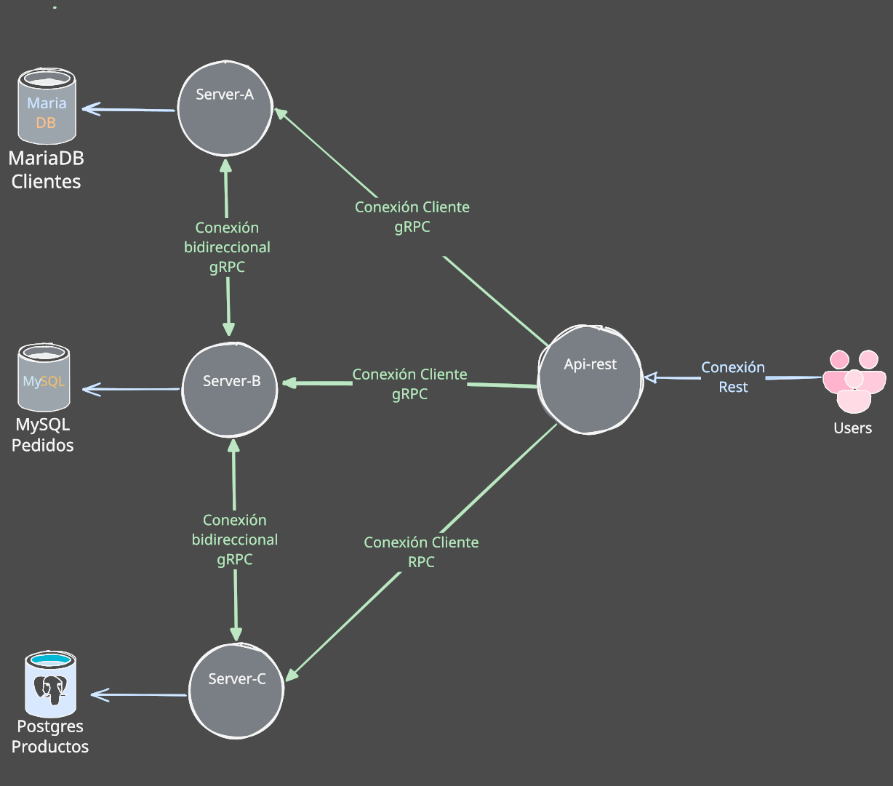

# microservicios-api-rest

## Descripción General

Este proyecto implementa una arquitectura de microservicios orientada a eventos e interconectada mediante **gRPC** y expuesta externamente a través de un **Gateway API REST** (Express). Cada microservicio gestiona su propia base de datos dedicada.

### Componentes y Tecnologías

| Servicio | Descripción | Tecnología Backend | Base de Datos | Puerto Interno / Host |
| :--- | :--- | :--- | :--- | :--- |
| **api-rest** | Gateway HTTP / REST API | Node.js (Express) | N/A | `3500` / `3000` |
| **server-a** | Microservicio de Clientes | Node.js + gRPC | **MariaDB 11** | `50055` / `50050` (DB: `4000`) |
| **server-b** | Microservicio de Pedidos | Node.js + gRPC | **MySQL LTS** | `50055` / `50051` (DB: `4001`) |
| **server-c** | Microservicio de Productos | Node.js + gRPC | **PostgreSQL 16.8** | `50055` / `50052` (DB: `4002`) |

---

## Diagrama de Arquitectura



El diagrama anterior ofrece una visión general de la arquitectura del proyecto, mostrando las conexiones gRPC entre los diferentes microservicios y la exposición vía API REST.

---

## Requisitos

Antes de comenzar, asegúrate de tener instaladas las siguientes herramientas:

- [Node.js](https://nodejs.org/es) (v18 o superior).
- [npm](https://www.npmjs.com/).
- [Podman](https://podman.io/) y [Podman Compose](https://docs.podman.io/en/latest/markdown/podman-compose.1.html) (o Docker / Docker Compose).
- [Protoc](https://grpc.io/docs/protoc-installation/).
- [grpcurl](https://github.com/fullstorydev/grpcurl) (opcional, para depuración gRPC).

---

## Instalación y Despliegue

Sigue estos pasos para configurar y levantar los servicios mediante contenedores:

1. **Clonar el Repositorio:**
   ```bash
   git clone <URL_DEL_REPOSITORIO>
   cd microservicios-api-rest
   ```

2. **Imágenes de Contenedor:**
   Las imágenes preconstruidas están disponibles en Docker Hub:
   - API REST Gateway: `docker pull cristiandv/api-rest:latest`
   - Servicio Clientes (Server A): `docker pull cristiandv/server-a:latest`
   - Servicio Pedidos (Server B): `docker pull cristiandv/server-b:latest`
   - Servicio Productos (Server C): `docker pull cristiandv/server-c:latest`

3. **Estructura de Directorios para el Despliegue:**
   Cada microservicio cuenta con su propio archivo `podman-compose.yaml` y scripts de inicialización SQL:
   ```bash
   .
   ├── api-rest
   │   └── podman-compose.yaml
   ├── server-a
   │   ├── a-init.sql
   │   └── podman-compose.yaml
   ├── server-b
   │   ├── b-init.sql
   │   └── podman-compose.yaml
   └── server-c
       ├── c-init.sql
       └── podman-compose.yaml
   ```

4. **Configuración de Variables de Entorno:**
   Cada microservicio incluye una plantilla `.env.example` en su directorio `server/`. Para la ejecución con `podman-compose`, se configuran las variables en cada archivo `podman-compose.yaml`.
   
   > [!IMPORTANT]
   > Para permitir la comunicación entre contenedores aislados que comparten la red del host, se debe usar `host.containers.internal:<puerto>` en las variables de conexión gRPC.
   
   Ejemplo para `server-a/podman-compose.yaml`:
   ```yaml
   node-server-a:
     image: docker.io/cristiandv/server-a
     working_dir: /app
     environment:
       DB_HOST: db-server-a
       DB_PORT: 3306
       DB_USER: user-a
       DB_PASSWORD: 12345
       DB_NAME: db-a
       SERVER_GRPC_PORT: 50055
       PEDIDOS_GRPC_IP_PORT: host.containers.internal:50051
     ports:
       - "50050:50055"
     depends_on:
       - db-server-a
   ```

5. **Iniciar los Servicios:**
   Navega a cada directorio (`server-a`, `server-b`, `server-c`, y finalmente `api-rest`) e inicia los servicios:
   ```bash
   # Iniciar bases de datos y servidores gRPC backend
   cd server-a && podman-compose up -d && cd ..
   cd server-b && podman-compose up -d && cd ..
   cd server-c && podman-compose up -d && cd ..

   # Iniciar el API REST Gateway
   cd api-rest && podman-compose up -d && cd ..
   ```

   Verifica el estado de los contenedores activos:
   ```bash
   podman ps
   ```

---

## Endpoints de la API REST

El API Gateway escucha en `http://localhost:3000`.

### 1. Clientes (`/clientes`, `/cliente`)

| Método | Endpoint | Descripción | Body (JSON) |
| :--- | :--- | :--- | :--- |
| `GET` | `/clientes` | Obtener la lista completa de clientes | N/A |
| `GET` | `/cliente/:clienteId` | Obtener información de un cliente por UUID | N/A |
| `POST` | `/clientes` | Crear un nuevo cliente | `{"nombre": "String", "email": "String", "telefono": "String"}` |
| `PUT` | `/cliente/:clienteId` | Actualizar nombre y email de un cliente | `{"nombre": "String", "email": "String"}` |
| `DELETE` | `/cliente/:clienteId` | Eliminar un cliente por UUID | N/A |
| `PUT` | `/cliente/telefonos/:clienteId` | Agregar un número de teléfono | `{"telefono": "String"}` |
| `DELETE` | `/cliente/telefonos/:clienteId` | Eliminar un número de teléfono | `{"telefono": "String"}` |

### 2. Productos (`/productos`, `/producto`)

| Método | Endpoint | Descripción | Body (JSON) |
| :--- | :--- | :--- | :--- |
| `GET` | `/productos` | Obtener el catálogo de productos | N/A |
| `GET` | `/producto/:productoId` | Obtener detalle de producto por UUID | N/A |
| `POST` | `/productos` | Registrar un nuevo producto | `{"nombre": "String", "precio": 0.00, "cantidad": 0}` |
| `PUT` | `/producto/:productoId` | Actualizar un producto existente | `{"nombre": "String", "precio": 0.00, "cantidad": 0}` |
| `DELETE` | `/producto/:productoId` | Eliminar un producto por UUID | N/A |

### 3. Pedidos (`/pedidos`, `/pedido`)

| Método | Endpoint | Descripción | Body (JSON) |
| :--- | :--- | :--- | :--- |
| `GET` | `/pedidos/:clienteId` | Obtener los pedidos asociados a un cliente | N/A |
| `POST` | `/pedido/:clienteId` | Crear un pedido para un cliente | `{"productos": [{"productoId": "UUID", "cantidad": 1}]}` |
| `PUT` | `/pedido/:pedidoId` | Actualizar estado o ítems de un pedido | `{"estado": "pendiente|entregado|cancelado", "productos": [...]}` |
| `DELETE` | `/pedido/:pedidoId` | Eliminar un pedido específico por UUID | N/A |
| `DELETE` | `/pedidos/:clienteId` | Eliminar todos los pedidos de un cliente | N/A |

---

## Pruebas de la API

### Consumo vía REST (`curl`)

#### Listar Clientes
```bash
curl -X GET http://localhost:3000/clientes
```

#### Crear un nuevo Cliente
```bash
curl -X POST http://localhost:3000/clientes \
  -H "Content-Type: application/json" \
  -d '{
    "nombre": "Juan Pérez",
    "email": "juan.perez@example.com",
    "telefono": "+54 11 1234-5678"
  }'
```

#### Crear un Pedido
```bash
curl -X POST http://localhost:3000/pedido/11111111-1111-1111-1111-11111111111a \
  -H "Content-Type: application/json" \
  -d '{
    "productos": [
      { "productoId": "33333333-3333-3333-3333-33333333333a", "cantidad": 2 }
    ]
  }'
```

### Pruebas Directas a gRPC (`grpcurl`)

Si tienes `grpcurl` instalado, puedes consultar directamente los microservicios backend:

```bash
# Listar clientes en Server A (gRPC)
grpcurl -plaintext localhost:50050 clientes.ClientesService/ListClientes

# Obtener detalle de producto en Server C (gRPC)
grpcurl -plaintext -d '{"productoId": "33333333-3333-3333-3333-33333333333a"}' localhost:50052 productos.ProductosService/ProductoPorId
```

